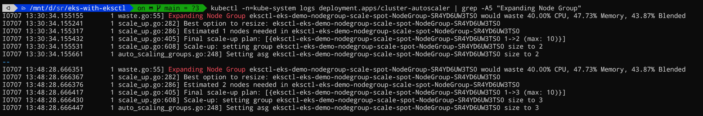
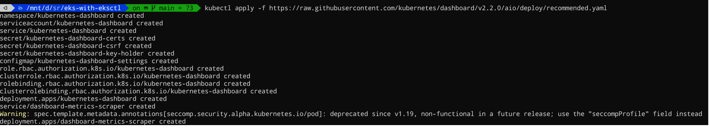

# Exploring AWS EKS with eksctl


## Introduction to Kubernetes


Kubernetes has emerged as the leading container orchestration platform, allowing developers to easily manage and scale containerized applications. It abstracts the underlying infrastructure, enabling developers to focus on application deployment and management in a scalable and resilient manner.

### Kubernetes Components

#### KUBE-APIServer

The KUBE-APIServer serves as the front end for the Kubernetes control plane, exposing the Kubernetes API. It facilitates communication between CLI tools (such as kubectl), users, and various master components (scheduler, controller manager, etcd), as well as worker node components like kubelet.

#### ETCD

ETCD is a highly-available and consistent key-value store used as the underlying storage for all cluster data in Kubernetes. It stores information about the master and worker nodes.

#### KUBE-Scheduler

The KUBE-Scheduler distributes containers across multiple nodes in the cluster. It monitors newly created Pods without assigned nodes and selects a suitable node for them to run on.

#### KUBE-Controller-manager

The KUBE-Controller-manager consists of several controllers that respond to various events in the cluster. These controllers detect and handle situations where nodes, containers, or endpoints become unavailable, making decisions to initiate actions such as bringing up new containers.

- Node-Controller: Monitors and responds to events when nodes go down in the cluster.
- Endpoints-Controller: Populates the Endpoints object by connecting Services and Pods.
- Service Account and Token Controller: Creates default accounts and provides API access for new namespaces.
- Cloud-Controller-Manager: Embeds cloud-specific control logic for Kubernetes clusters running on cloud providers.
- Route Controller: Sets up routes in the underlying cloud infrastructure.
- Service Controller: Manages creation, updating, and deletion of cloud provider load balancers.

#### Container Runtime

The Container Runtime is where Kubernetes components are run. Docker is commonly used, but other options like rkt and container-d are available.

#### Kubelet and Kube-Proxy

- Kubelet: Agent running on every node, ensuring containers within Pods run correctly.
- Kube-Proxy: Network proxy managing network rules, allowing communication to Pods from network sessions both inside and outside the cluster.

## Elastic Kubernetes Service (EKS)


### EKS Cluster Overview

An EKS (Elastic Kubernetes Service) cluster comprises several core objects as outlined below:

**EKS Control Plane:** The EKS Control Plane is a managed service provided by AWS. It consists of Kubernetes master components, including etcd, kube-apiserver, and kube-controller.

- Each EKS cluster has its own dedicated control plane, ensuring isolation between clusters and AWS accounts.
- The control plane runs at least two API server nodes and three etcd nodes spread across three Availability Zones within a region.
- AWS automatically detects and replaces unhealthy control plane instances by restarting them within the same region's Availability Zones.

**Worker Nodes and Node Groups:** Worker nodes are EC2 instances where application workloads run. In Kubernetes, these nodes are referred to as worker machines.

- EKS worker nodes reside in the AWS account and connect to the cluster's control plane via the cluster API server endpoint.
- Node groups consist of one or more EC2 instances deployed within an EC2 Autoscaling group.
- All instances within a node group must have the same instance type, run the same Amazon Machine Image (AMI), and utilize the same EKS worker node IAM role.

**Fargate Profiles (Serverless):** Instead of using EC2 instances, EKS allows running application workloads on Serverless Fargate profiles.

- AWS Fargate offers on-demand, appropriately sized compute capacity for containers.
- With Fargate, there's no need to provision, configure, or scale groups of virtual machines for running containers.
- Each pod running on Fargate has its own isolation boundary, ensuring it does not share the underlying kernel, CPU resources, memory resources, or elastic network interface with other pods.
- AWS has specifically built Fargate controllers to recognize and schedule pods on Fargate profiles.

**VPC:** AWS VPC (Virtual Private Cloud) is used to implement secure networking standards for running production workloads on EKS.

- EKS leverages AWS VPC network policies to restrict traffic between control plane components within a single cluster.
- The control plane components of an EKS cluster are isolated and cannot communicate with other clusters or AWS accounts, except as authorized through Kubernetes RBAC (Role-Based Access Control) policies.
- This secure and highly available configuration makes EKS a reliable and recommended choice for production workloads.

## What we are going to deploy?


In this blog post, we will deploy an EKS cluster using eksctl, a command-line tool provided by AWS for creating and managing EKS clusters. After cluster deployment, the following AWS resources will be provisioned:

- EKS Cluster: The core control plane for managing the Kubernetes cluster.
- VPC: A Virtual Private Cloud providing network isolation for the cluster.
- Subnets: Subnets distributed across Availability Zones for high availability.
- Security Groups: Rules controlling inbound and outbound traffic to the cluster.
- Node Groups: Groups containing worker nodes
- Worker Nodes: EC2 servers in the EKS data plane

## Prerequisite for EKS-related activities

### Getting User and Roles configured using AWS IAM for EKS:

Create an IAM user for each person who needs access to the EKS cluster. This can be done through the IAM console or CLI. Provide a dedicated list of privileges/policies to this user
to cover all the required privileges, first, you have to create additional policies like the below;

**EKS-Demo-Admin-policy**

```
{
   "Version": "2012-10-17",
   "Statement": [
        {
           "Effect": "Allow",
           "Action": [
               "eks:*"
            ],
           "Resource": "*"
        }
    ]
}
```

**CloudFormation-Demo-Admin-policy**

```
{
    "Version": "2012-10-17",
    "Statement": [
        {
            "Effect": "Allow",
            "Action": [
                "cloudformation:*"
            ],
            "Resource": "*"
        }
    ]
}
```

finally, assign the following policies to the IAM user which we are going to use in this exercise:

- AmazonEC2FullAccess
- IAMFullAccess
- AmazonVPCFullAccess
- CloudFormation-Demo-Admin-policy
- EKS-Demo-Admin-policy

### Installation and configuration of all relevant CLIs:

To set up and manage your Amazon EKS cluster, you will need to install and configure several command-line interfaces (CLIs). These CLIs enable you to interact with the EKS service, deploy and manage your cluster, and perform various operations. Let's go through the installation and configuration steps for the relevant CLIs.

**AWS CLI:**

1. Install the AWS CLI by following the instructions provided in the AWS CLI User Guide.
2. Configure the AWS CLI by running the aws configure command and providing your AWS Access Key ID, Secret Access Key, default region, and output format.

**eksctl:**

1. Install eksctl by following the instructions provided in the official eksctl GitHub repository.
2. Verify the installation by running the eksctl version command.

**kubectl:**

1. Install kubectl by following the instructions provided in the official Kubernetes documentation here.
2. Verify the installation by running the kubectl version command.

## Deployment Using eksctl


The above figure shows a snapshot of the EKS cluster deploying process using eksctl.

`eksctl create cluster --config-file=eks-autoscaler-setup.yaml `

With the above command, we accomplished the deployment.
The deployment process has created ;

- Subnets in east-1-b and east1-d availability zones (1 public and 1 private per AZs)
- All three node groups used similar EC2 images (AmazonLinux2/1.25), it all depends on the availability of the images at the time of deployment, however, images will be the same for all the node groups.
- CloudFormation stacks were deployed for cluster master plane and Node groups. All the node groups are deployed with Autoscaling config enabled.

### EKS Deployment Configuration Explained:

```
apiVersion: eksctl.io/v1alpha5
kind: ClusterConfig

metadata:
  name: eks-demo
  region: us-east-1

nodeGroups:
  - name: scale-east-1b
    instanceType: t2.small
    desiredCapacity: 1
    maxSize: 10
    availabilityZones: ["us-east-1b"]
    iam:
      withAddonPolicies:
        autoScaler: true
    labels:
      nodegroup-type: stateful-east-1b
      instance-type: onDemand
    ssh: # use existing EC2 key
      publicKeyName: demokey1
  - name: scale-east-1d
    instanceType: t2.small
    desiredCapacity: 1
    maxSize: 10
    availabilityZones: ["us-east-1d"]
    iam:
      withAddonPolicies:
        autoScaler: true
    labels:
      nodegroup-type: stateful-east-1d
      instance-type: onDemand
    ssh: # use existing EC2 key
      publicKeyName: demokey1
  - name: scale-spot
    desiredCapacity: 1
    maxSize: 10
    instancesDistribution:
      instanceTypes: ["t2.small", "t3.small"]
      onDemandBaseCapacity: 0
      onDemandPercentageAboveBaseCapacity: 0
    availabilityZones: ["us-east-1b", "us-east-1d"]
    iam:
      withAddonPolicies:
        autoScaler: true
    labels:
      nodegroup-type: stateless-workload
      instance-type: spot
    ssh:
      publicKeyName: demokey1

availabilityZones: ["us-east-1b", "us-east-1d"]
```

The above configuration shows that three node groups were deployed namely scale-east-1b, scale-east-1d, and scale-spot.

scale-east-1b targetted to us-east-1b AZ

scale-east-1d targetted to us-east-1d AZ

scale-spot targetted to both us-east-1b and us-east-1d AZs

scale-spot is configured to deploy spot instance types and other two node groups are configured to deploy onDemand instances.

all the node groups are enabled with autoscaler add-on policy.

region deployment is us-east-1

cluster name is eks-demo


The above figure shows the deployed worker nodes. We can verify the nodes using the below command;

`kubectl get nodes`


The above figure shows the deployed cluster.


The above figure shows the deployed cluster overview in the AWS console.


The above figure shows the network info of the deployed EKS cluster.


The above figure shows CloudFormation stacks deployed for the cluster and all three node groups.


The above figure shows deployed elastic ip for the cluster.


The above figure shows created security groups for the deployed EKS cluster.


The above figure shows one of the autoscaling groups connected with a node group.

## EKS Cluster Operations

### Nodegroup Scaling

EKS enables dynamic scaling of worker nodes based on resource demands. Nodegroup scaling allows adjusting the number of worker nodes in the cluster to accommodate changes in workload.

### Cluster Autoscaler

The Cluster Autoscaler automatically adjusts the size of the EKS cluster by adding or removing worker nodes based on the resource utilization of the cluster. It ensures the availability of sufficient computing capacity to handle application demands. Some of the salient features of cluster autoscaler are;

- Responsible for dynamically scaling the Nodes within a node group – in and out
- Runs as deployment
- Multi Az and Single AZ scaling possible
  - Nodegroup with a single AZ is preferable for stateful workloads
  - Nodegroup with multi-AZ is preferable for stateless workloads
- A Mixture of On-Demand and Spot instances possible


The above figure shows the deployment of the cluster autoscaler. We can use the below command to deploy the cluster autoscaler;

```
kubectl apply -f https://raw.githubusercontent.com/kubernetes/autoscaler/master/cluster-autoscaler/cloudprovider/aws/examples/cluster-autoscaler-autodiscover.yaml
```


The above figure shows the editing of deployed cluster autoscaler. Editing of the cluster autoscaler deployment required putting the correct cluster name and version.


The above figure shows the edited cluster autoscaler deployment.

Annotate the cluster autoscaler deployment to **safe-to-evist=false** it will help existing pods not to break down while scaling down the nodes.


The above figure shows the update annotation of deployed cluster autoscaler.

### Testing Autoscaler

To validate the effectiveness of the Autoscaler, it is important to conduct testing. This involves subjecting the cluster to varying workloads and monitoring the Autoscaler's response to ensure it scales the cluster appropriately.


We deployed an Nginx application for testing our autoscaling operations. The above figure shows the same. The **nginx-deployment.yaml** is being used to deploy the nginx application.


The above figure shows the scaling of the Nginx application to 5 replicas.


Nginx application pods are getting scaled in the above figure.


The above figure shows how the spot nodes were getting deployed due to scaling operations on the Nginx application. In our nginx deployment, we have specifically targeted spot instance types, due to this instances were getting deployed in the spot-scale node group.


The above figure shows spot requests in action after node autoscaling.


The above figure shows the scaling down of nginx pods.


The above figure shows scaled-down spot requests.



The above figure shows the node group expanding logic in action during the scaling operation.

## Cluster Monitoring Using Kubernetes Dashboard

Kubernetes Dashboard is a web-based user interface that provides a visual representation of your EKS cluster. It allows you to monitor and manage your cluster's components, such as pods, services, deployments, and more. Let's explore how to set up and use the Kubernetes Dashboard for cluster monitoring.

### Dashboard Components

The Kubernetes Dashboard consists of several components that provide detailed information about your EKS cluster. Let's explore some of the key components:

1. **Cluster Overview:** The Cluster Overview provides an overview of your EKS cluster, including information about nodes, namespaces, pods, and services. It gives you a high-level view of the current state of your cluster.
2. **Nodes:** The Nodes section displays detailed information about the worker nodes in your EKS cluster. It provides insights into the node's status, capacity, and allocated resources.
3. **Namespaces:** Namespaces allow you to logically divide your cluster into virtual clusters. The Namespaces section shows all the namespaces in your cluster and allows you to switch between them to view specific resources.
4. **Pods:** The Pods section provides a list of all the pods running in your cluster. It shows information such as the pod's name, status, and allocated resources. You can also view logs and terminal access for individual pods.
5. **Services:** The Services section displays all the services in your cluster. It provides information about the service's name, type, IP address, and associated pods. You can also access detailed information about each service.
6. **Deployments:** The Deployments section shows all the deployments in your cluster. It provides information about the deployment's name, replicas, current status, and more. You can also scale deployments and perform rolling updates from the Dashboard.
7. **Events:** The Events section displays all the events happening in your cluster, such as pod creations, deletions, and other important activities. It helps you monitor the health and status of your cluster.

### Installation and Accessing the Dashboard



The above figure shows the deployment of the dashboard component.

To install the Kubernetes Dashboard, you can use the following command:

`kubectl apply -f https://raw.githubusercontent.com/kubernetes/dashboard/v2.X.X/aio/deploy/recommended.yaml`

Replace v2.X.X with the desired version of the Dashboard. I have used v2.2.2.


The above figure shows the service account creation and role-binding for accessing the dashboard. **admin-service-account.yaml** and **dashboard-account-rbac.yam** were used to deploy the same.

Once the installation is complete, you can access the Dashboard by running the following command:

`kubectl proxy`

This command creates a local proxy that allows you to access the Dashboard through a web browser. In the below section, we mentioned how to access the dashboard.

To access the Kubernetes Dashboard, open a web browser and navigate to the URL provided **http://localhost:8001/api/v1/namespaces/kubernetes-dashboard/services/https:kubernetes-dashboard:/proxy/**.

You will be prompted for authentication. To obtain the authentication token, run the following command

`kubectl create token eks-demo-dashboard-admin -n=kube-system`


The above figure shows Kubernetes metrics in deployed Dashboard UI.

## Logging Using CloudWatch

AWS CloudWatch is a comprehensive monitoring and logging service that allows you to collect, analyze, and visualize logs generated by your EKS cluster. By configuring the cluster to send logs to CloudWatch, you can centralize and effectively manage your log data. Let's explore how to activate logging for your EKS cluster and set up the integration with CloudWatch.

**Step 1: Create an IAM Policy**

To enable logging for your EKS cluster, you need to create an IAM policy that grants the necessary permissions for the cluster to send logs to CloudWatch. Here's an example IAM policy that you can use:

```
{
  "Version": "2012-10-17",
  "Statement": [
    {
      "Effect": "Allow",
      "Action": [
        "logs:CreateLogGroup",
        "logs:CreateLogStream",
        "logs:PutLogEvents",
        "logs:DescribeLogGroups",
        "logs:DescribeLogStreams"
      ],
      "Resource": "*"
    }
  ]
}
```

Ensure that you attach this IAM policy to the IAM role associated with your EKS cluster.

**Step 2: Enable Cluster-Level Logging**

To activate logging for your EKS cluster, you need to update the cluster configuration to specify the log types you want to enable. You can use the **eksctl** command-line tool or the AWS Management Console to perform this step.

Using **eksctl**, you can update the cluster with the following command:

` eksctl utils update-cluster-logging --cluster eks-demo --enable-types all –approve`

Common log types include **api, audit, authenticator, controllerManager**, and **scheduler**. Separate multiple log types with commas.


The above figure shows the command to enable logging.

**Step 3: View Logs in CloudWatch**


The above figure shows the log overview from AWS CloudWatch Console.

Once logging is enabled, your EKS cluster will start sending logs to CloudWatch. You can view these logs in the AWS Management Console by following these steps:

1. Open the CloudWatch service in the AWS Management Console.
2. In the left navigation pane, select "Logs".
3. Locate the log group associated with your EKS cluster. The log group will have a name following the format **/aws/eks/<cluster-name>/**.
4. Click on the log group name to access the log streams within the group.
5. Select a log stream to view the associated log events.
   From the CloudWatch console, you can search, filter, and analyze logs. You can also set up log metric filters and alarms to receive notifications for specific log events.

## Clean-up Everything

Once you have finished working with your EKS cluster and the deployed applications, it is essential to clean up the resources to avoid unnecessary costs. Follow these steps to clean up:

1. Delete any running deployments and services.
2. Delete the EKS cluster using the appropriate command or eksctl configuration.
3. Delete any associated VPCs, subnets, and security groups created for the cluster.
   By following these steps, you can ensure that no lingering resources remain and maintain a clean AWS environment.

## Summary

Just to summarize the post 😊

In this blog post, we introduced **AWS Elastic Kubernetes Service (EKS)** and explored how to get started with it. We covered the fundamentals of **Kubernetes** and its significance in modern application development. We then delved into the architecture of EKS, understanding its key components and their roles.

We went deeper into EKS, exploring its components such as the **control plane** and **node groups**. We learned how to deploy an EKS cluster using **eksctl** and discussed various cluster operations, including node group scaling and **cluster autoscaling**.

We explored cluster monitoring using the **Kubernetes Dashboard** and learned how to leverage **AWS CloudWatch** for logging.

Finally, we emphasized the importance of cleaning up resources to avoid unnecessary costs and maintain a clean **AWS environment**.

Armed with this knowledge, you are now ready to embark on your journey with AWS EKS and harness its power for scalable and resilient container orchestration. Happy deploying!

I will be back with some other topic, till then Bye!

## Credits

- Amazon Web Services (AWS): AWS provides the Elastic Kubernetes Service (EKS), a fully managed Kubernetes service. With EKS, developers can deploy, scale, and manage containerized applications using the power of AWS infrastructure. Learn more about AWS EKS at https://aws.amazon.com/eks/
- eksctl: eksctl is a command-line tool created by Weaveworks that simplifies the process of creating and managing EKS clusters. It provides a convenient way to deploy and manage EKS clusters with minimal configuration. To learn more about eksctl, visit the official GitHub repository at https://github.com/weaveworks/eksctl
- Cloud Native Computing Foundation (CNCF): The Cloud Native Computing Foundation is an open-source software foundation that hosts a variety of cloud-native projects, including Kubernetes. CNCF promotes the adoption and sustainability of cloud-native technologies and ecosystems. For more information about CNCF and its projects, visit https://www.cncf.io/
